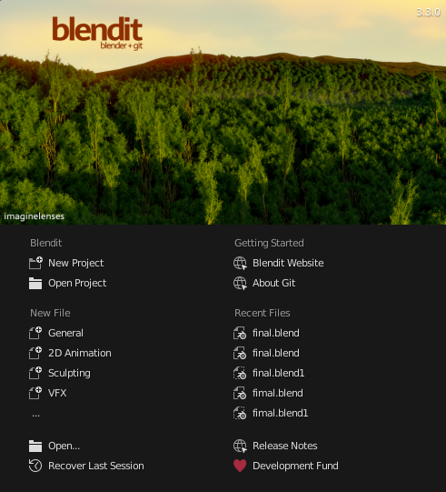

<h1 id="blendit">Blendit (Blender + Git)</h1>

A [Git](https://git-scm.com/) integration for [Blender](https://www.blender.org/). 
Blendit brings ***Version Control*** to Blender.

 

<h2 id="version-control">Version Control</h2>

Version Control helps you track different versions of your project. Working on a project overtime you may want to keep track of which changes were made, by whom, and when those changes were made.

Version control has been standard practice in software development to keep track of changes made to source code for years now. However, when it comes to working with files other than textual files you usually out of luck.

While Git and other Version Control Systems (VCS) can track `.blend` (binary) files it does not make much sense as they are designed for textual files.

That said, according to [Sybren](https://github.com/sybrenstuvel/) on [Blender Stack Exchange](https://blender.stackexchange.com/a/108186/154740), Blender Institute uses [Subversion](https://subversion.apache.org/).
> At the Blender Institute / Blender Animation Studio we use Subversion for our projects. It works fine for blend files, but you have to make sure they are not compressed. Compression can cause the entire file to be different when only a single byte changed, whereas in the uncompressed blend file only that one byte will differ. As a result, binary diffs will be much smaller, and your repository will be faster to work with.

<h2 id="how">How does Blendit work?</h2>

Instead of tracking the `.blend` (binary) files itself, Blendit tracks the *changes* you make to the `.blend` file in real time. It does so by keeping track of the python commands, from the [Blender API](https://docs.blender.org/api/current/index.html), used to make changes.

Each time you open a Blendit project, it regenerates the `.blend` files. This means you can delete the `.blend` file and still retain the project.

This way we only track a textual (`.py`) file as Git was intended to be used. 

In theory the size of the entire project should be lower than using any other VSC.

<h2 id="dependencies">Dependencies</h2>

- Blendit uses [pygit2](https://github.com/libgit2/pygit2) for *Git Plumbing*.
- pygit2 is installed automatically using pip when you first open Blendit. 
- Therefore Blendit requires an internet connection when you open it for the first time.

<h2 id="license">License</h2>

Like Blender and Git, Blendit is also licensed under the GNU General Public License. 

See [Full License](https://github.com/imaginelenses/blendit/blob/main/LICENSE).
