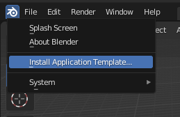
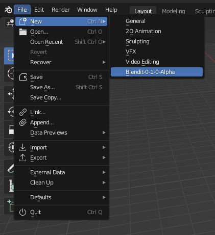
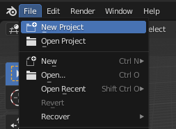
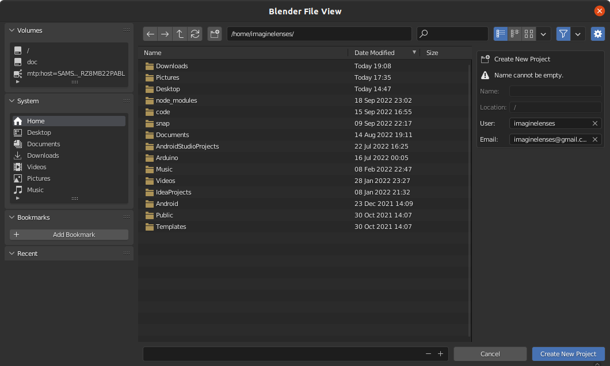
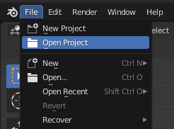
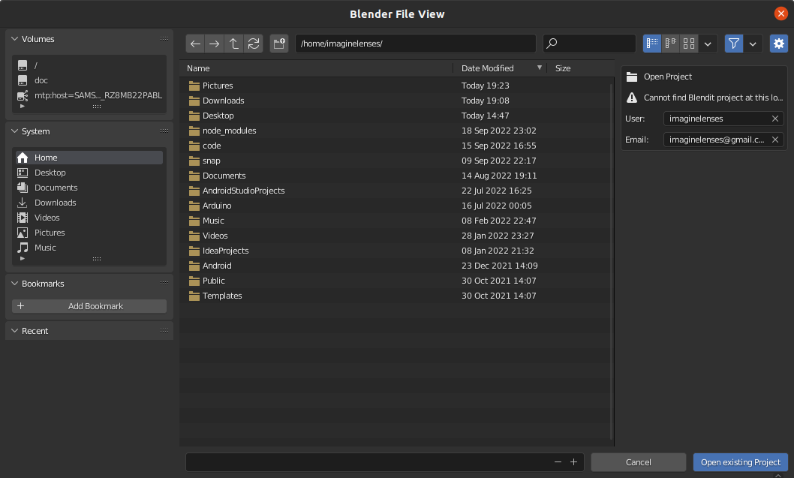
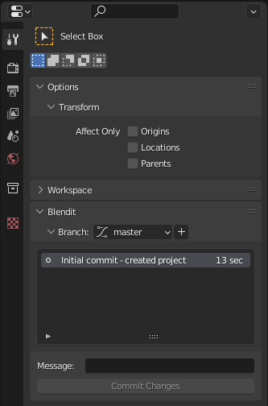
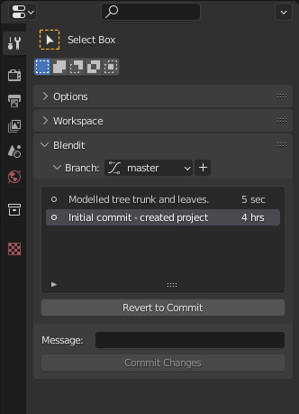
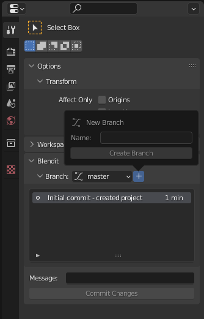
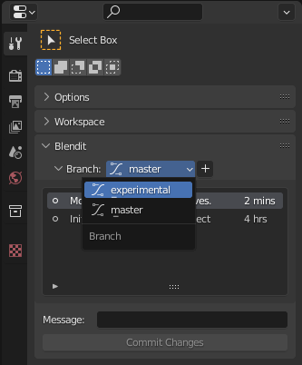

<h1 id="getting-started">Getting Started</h1>

1. Download Blendit `.zip` file from <a role="button" aria-label="Blendit download link." href="{{ downloadLink }}">here</a>.

2. Install Blendit [Application Template](https://docs.blender.org/manual/en/latest/advanced/app_templates.html#app-templates).
        
   
   - Open Blender and click the `Blender Menu ▸ Install Application Template` submenu

        

   - Select the downloaded `.zip` file.

3. Blendit Application templates can be selected from the splash screen or `File ▸ New` submenu.

    

    **Note**: The first time you open Blendit it will take a some time to load.

    **For Windows**: Run Blender as administrator the first time you open Blendit.

<h2 id="new-project">New Project</h2>

- Create a new Project from the splash screen or `File ▸ New Project` submenu.

    

- Select a *location* to save the project and type the *name* of the project in the bottom.

    

- Provide your *username* and *email*, on the right, to keep track of who made what changes.
    
    **Note**: If you have use Git and have a global git config file, theses details are auto-filled.

<h2 id="open-project">Open Project</h2>

- Open a Project from the splash screen or `File ▸ Open Project` submenu.

    
    
- Locate the project you want to open.
    
    

    **Note**: The *username* and *email* details shown are of the previous *commiter* - if that isn't you do change it. 

<h2 id="commits">Commits</h2>

- Commits are process of saving snapshots of your project.
- Create a new Commit from the *Blendit* panel in the *Properties* area, under *Active Tools and Workspace settings* tab.

    

- Each Commit requires an accompanying *Commit Message* describing the commit

<h2 id="revert-commit">Revert Commit</h2>

- You can go back time by reverting to a Commit from the past.
- Revert to a Commit by first selecting it from the list of Commits under the *Branch* subpanel and clicking `Revert to Commit` button
  
    

  
<h2 id="branches">Branches</h2>

- Branches are the forks in the road, so to speak.
- Create a new Branch by clicking `+` button next to the Branches dropdown in the *Branches* subpanel.

    

- Change to that Branch by selecting it from the Branches list dropdown.

    

Here is an extract from the [About Git](https://git-scm.com/about) website. While this is written targeting *Software Development*, most of these points are applicable to *creative workflows* too.

> - **Frictionless Context Switching.** Create a branch to try out an idea, commit a few times, switch back to where you branched from, apply a patch, switch back to where you are experimenting, and merge it in.
> - **Role-Based Codelines.** Have a branch that always contains only what goes to production, another that you merge work into for testing, and several smaller ones for day to day work.
> - **Feature Based Workflow.** Create new branches for each new feature you're working on so you can seamlessly switch back and forth between them, then delete each branch when that feature gets merged into your main line.
> - **Disposable Experimentation.** Create a branch to experiment in, realize it's not going to work, and just delete it - abandoning the work—with nobody else ever seeing it (even if you've pushed other branches in the meantime).

<h2 id="assets">Assets</h2>

- All assets like materials, textures, etc. should be stored within the `/assets` folder within the project.
- **Note:** Changes made to the `/assets` folder is ***not***  tracked by Blendit.

